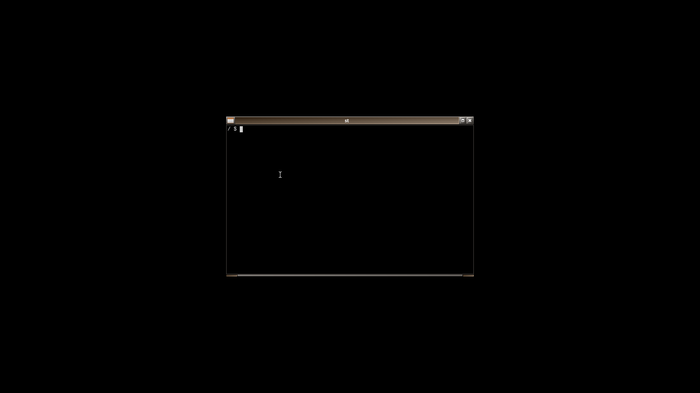
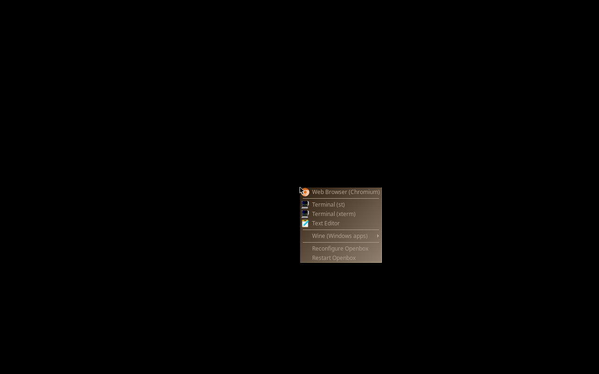
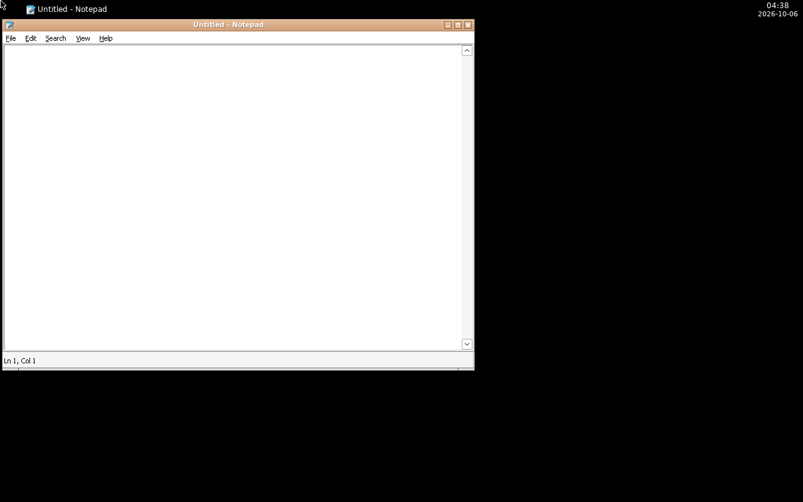
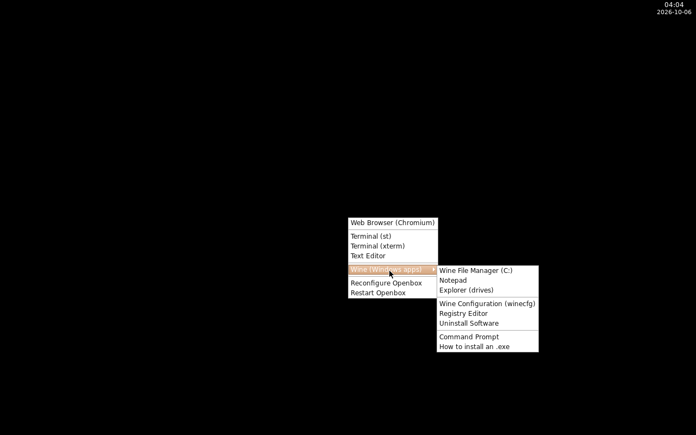

# webtop:alpine-openbox-novnc

一个从头构建的 Alpine + Openbox 桌面镜像，通过 **VNC / noVNC** 在浏览器中访问。
**完全不依赖 LinuxServer 的 selkies 基础镜像**，因此不受上游停更影响。

镜像刻意保持最小：**chromium + openbox + wine**，加上会话运行必需的组件。
**不带 docker cli**（v2 起移除），**不带状态栏面板**（v3 起移除），
桌面分辨率**跟着浏览器窗口自适应**（v3 起）。

> **v3 变更（本次）**
> 1. **去掉顶部 status bar**：`tint2` 面板不再安装（连带把"Wine 窗口churn
>    导致 tint2 段错误"那套问题一起删掉了，见下方历史记录）。
> 2. **分辨率自适应**：`Xvfb + x11vnc` 换成单个 **TigerVNC Xvnc** ——
>    x11vnc 会丢弃浏览器发来的 `SetDesktopSize`（实测），Xvnc 会照做，
>    于是桌面尺寸随浏览器窗口变化。另加 `app/webtop-adaptive.js`：在 noVNC
>    初始化前把 `resize=remote` 写进浏览器存储，避免"浏览器里存过旧设置导致
>    自动适配永远不触发"（见下文说明；URL 显式参数仍然优先）。
>
> 早前版本：v2 去掉 `docker-cli`、加入 **Wine 10.7**；v1（带 docker cli）
> 的 Dockerfile 存于 `novnc/alpine-openbox/archive/Dockerfile.v1-dockercli`。

## 架构（已从 selkies 换成 noVNC）

```
Xvnc (:1, 初始 1280x800，之后随浏览器自适应)   ← X 服务器 + VNC 服务端，一个进程
  ├── openbox            ← 窗口管理器（无面板）
  ├── wine               ← Windows 兼容层（按需启动，非常驻）
  └── websockify + noVNC (3000)  ← 浏览器访问（RFB 走 127.0.0.1:5901）
```

全部组件由 **supervisor** 托管，任一进程崩溃会自动重启。
所有软件包来自 Alpine 官方仓库，重建时只需跟随 Alpine 本身。

| 项目 | 旧 `linuxserver/webtop:alpine-openbox` | 本镜像 |
|---|---|---|
| 构建时间 | 2025-06-24（14 个月前） | 本次构建 |
| Alpine | **3.21.3** | **3.22.6**（`apk upgrade` 跟随 3.22 分支） |
| Chromium | 136.0.7103.113 | **跟随 Alpine 仓库** |
| Windows 程序 | 无 | **Wine 10.7（含 32 位 WoW64）** |
| 串流层 | selkies / pixelflux | **Xvnc (TigerVNC 1.15) + noVNC 1.6.0** |
| 分辨率 | 自适应（selkies） | **自适应（Xvnc SetDesktopSize）** |
| 状态栏面板 | 无 | **无（v3 移除 tint2）** |
| 基础镜像 | `baseimage-selkies:alpine321` | **`alpine:3.22` 官方** |
| docker cli | 有 | **无（v2 移除）** |
| 镜像体积 | 2.59 GB | **1.91 GB**（v1 无 Wine 是 1.39 GB） |
| Web 端口 | 3001 | **3000** |

## 目录结构

```
.
├── novnc/alpine-openbox/        # 本镜像（推荐）
│   ├── Dockerfile
│   ├── archive/                 # 旧版 Dockerfile 留存
│   │   └── Dockerfile.v1-dockercli
│   └── root/
│       ├── etc/supervisord.conf         # supervisor 主配置
│       ├── etc/supervisor.d/            # xvnc / openbox / novnc
│       ├── etc/cont-init.d/10-setup     # 首次运行初始化（含默认文件升级）
│       ├── etc/xdg/mimeapps.list        # .exe 默认交给 Wine 打开
│       ├── defaults/                    # menu.xml / rc.xml / autostart
│       │   └── *.v1                     # 上一版默认文件，用于安全升级比对
│       ├── usr/share/applications/      # wine-webtop.desktop
│       ├── usr/bin/
│       │   ├── start-desktop            # 入口脚本
│       │   ├── chromium-webtop          # Chromium 启动包装（见下）
│       │   ├── wine-webtop              # Wine 启动包装（见下）
│       │   └── wine-prefix-init         # 首次构建 Wine 前缀
│       └── usr/local/bin/
│           └── openbox-lsio-style       # 施加 LinuxServer 的 openbox 样式
├── scripts/
│   ├── build.sh                 # 一键构建
│   ├── verify.sh                # 一键验证（37 项检查）
│   ├── chromium-regression.sh   # Chromium 菜单启动回归测试
│   ├── wine-regression.sh       # Wine 回归测试（64/32 位、字体、窗口）
│   ├── vncprobe.py              # VNC 像素探测（数颜色，verify.sh 用）
│   ├── vncresize.py             # 请求服务器改分辨率（验证自适应，verify.sh 用）
│   ├── vncshot.py               # VNC 截图（存 PNG，肉眼排查用）
│   └── fetch-baseimage.sh       # 旧 selkies 镜像取基础镜像用
├── logs/                        # 构建/验证日志与桌面实拍截图
└── alpine-openbox/, alpine-sway/  # 旧的 selkies 版本（保留备份）
```

## 构建与运行

### 用 compose（推荐：构建 + 启动一条命令）

```bash
docker compose up -d --build     # 构建镜像并启动，UI 在 http://<主机IP>:3000
docker compose logs -f           # 入口横幅 + supervisor 日志
docker compose down              # 停掉（./config 里的状态都保留）
```

compose 文件里带 `build:` 段（context = `novnc/alpine-openbox`），
所以**不必先跑 `scripts/build.sh`**——那条路只是额外传一个真实的
`BUILD_DATE` 并多打一个 `webtop:alpine-openbox-<TAG>` 别名。
`docker compose ps` 会显示 `(healthy)`：镜像里用 busybox `wget` 探 3000 端口。

可调项都能用环境变量或 `.env` 覆盖（模板见 `.env.example`）：

| 变量 | 默认 | 说明 |
|---|---|---|
| `WEB_PORT` | `3000` | 发布到宿主机的端口（容器内固定 3000） |
| `CONFIG_DIR` | `./config` | `/config` 的位置：Wine 前缀、Chromium profile、桌面配置 |
| `APK_MIRROR` | `mirror.nju.edu.cn` | 构建时的 Alpine 镜像源 |
| `TAG` | `novnc` | 镜像别名标签（`webtop:alpine-openbox-<TAG>`） |

> 本机 3000 端口被常驻的 `webtop1` 占用，所以仓库**外**的本地 `.env` 里写了
> `WEB_PORT=3002`（`.env` 已被 gitignore）。删掉那一行或改成 `3000`
> 就是默认行为。

### 不用 compose（等价写法）

```bash
./scripts/build.sh

docker run -d --name webtop \
  -p 3000:3000 \
  -e PUID=1000 -e PGID=1000 \
  -e TZ=Asia/Shanghai \
  -v "$PWD/config:/config" \
  --shm-size=512m \
  webtop:alpine-openbox-novnc
```

- `-p 3000:3000` 换成宿主上没被占用的端口即可（例如 `3002:3000`）。
- 建议 `--shm-size=512m` 或更大：Chromium 在默认 64 MB `/dev/shm` 下更容易卡。
- `/config` 里存 Wine 前缀与 Chromium profile；把 `.exe` 丢进
  `config/Desktop` 就能在桌面里双击安装/运行。

浏览器打开 `http://<主机IP>:3000` → 直接进入 noVNC 桌面。

### 环境变量

| 变量 | 默认值 | 说明 |
|---|---|---|
| `PUID` / `PGID` | 1000 | 容器内 `abc` 用户 uid/gid |
| `TZ` | - | 时区，如 `Asia/Shanghai` |
| `VNC_RESOLUTION` | `1280x800` | **初始/最小**分辨率；浏览器连上后会按其窗口自适应调整（见下） |
| `VNC_DEPTH` | `24` | 色深 |
| `VNC_PORT` | `5901` | 内部 VNC 端口（**不对外暴露**） |
| `NOVNC_PORT` | `3000` | Web 端口 |
| `WINEPREFIX` | `/config/.wine` | Wine 前缀目录（在 /config 卷里，可持久化） |
| `WINEDEBUG` | `-all` | Wine 日志级别；排查问题时设成空值可看全部日志 |
| `WINEDLLOVERRIDES` | `mscoree,mshtml=` | 禁用 .NET/IE 组件：Alpine 没有 wine-mono/wine-gecko，禁用后程序快速报错而不是弹一个永远下载不完的对话框 |

改初始分辨率示例：`-e VNC_RESOLUTION=1920x1080`

### 分辨率自适应

浏览器打开后，noVNC 会把**浏览器可视区尺寸**通过 RFB `SetDesktopSize`
发给服务器，桌面（含已开窗口）随之重排；拖动/缩放浏览器窗口会再次触发。
所以 `VNC_RESOLUTION` 只是**起始尺寸**，既不是下限也不是上限：连接后浏览器
可以把它调大也能调小（实测 800×600 ~ 1920×1080 都照做）。

### 让"自动"真的自动（v3.1）

noVNC 解析设置值的顺序是（`app/ui.js` 的 `initSetting`）：

```
val = WebUtil.getConfigVar('resize');        // 1. URL 参数 ?resize=... / #resize=...
if (val === null) val = WebUtil.readSetting('resize', defVal);
                                         // 2. 先 localStorage，再默认值
```

也就是说：**浏览器里存过的值会盖掉镜像里的默认值**。旧版页面（默认还是
`resize=off`）在某个浏览器里存过 `off`/`scale`，那个浏览器就再也不会自动适配
了——改镜像默认值救不了它。

所以镜像里加了 `app/webtop-adaptive.js`，它被放在 **noVNC 初始化之前**加载
（`vnc.html` 里紧跟 `error-handler.js`），于是可以抢在解析之前把
`resize=remote` 写进存储：

- 浏览器里存着 `off`/`scale` → 被改写成 `remote`，自动适配恢复；
- URL 上显式写了 `?resize=off`（或 `scale`）→ **仍然优先**，脚本不干预；
- 存储不可用（隐私模式）→ 退回镜像默认值 `remote`，依然自适应。

没有用 noVNC 的 `mandatory.json`：那个会把设置项**锁死并置灰**，等于把选择权
彻底拿走；现在 URL 参数仍然是逃生口。

```
?resize=remote   默认，且会被这个脚本固化（推荐）
?resize=scale    只在浏览器端缩放，不动服务器
?resize=off      完全固定，不缩放也不改尺寸（截图/自动化用）
```

脚本会把结果写在 `<html data-webtop-resize="...">` 上，`verify.sh` 用无头
Chromium 打开真实页面读这个属性，确认覆盖真的生效（并且 `?resize=off` 仍然
被尊重）。

行为验证（在浏览器 profile 里真的种一个 `resize=scale`，再用它打开页面）：

| 浏览器里存的 | URL | 桌面尺寸（起始 1280×800，窗口 1000×700） |
|---|---|---|
| `scale` | 无参数 | **→ 1000×561**：覆盖生效，自动适配 ✅ |
| `scale` | `?resize=scale` | 保持 1280×800：显式参数优先，不干预 ✅ |

实现关键：v2 用的 `x11vnc` **会丢弃这个请求**（实测 1280x800 请求 1600x900
仍是 1280x800），v3 换成 TigerVNC 的 **Xvnc** 才会照做（同一次实测变成
1600x900）。noVNC 端的默认值也从 `resize=off` 改成 `resize=remote`
（构建时打补丁并断言，补丁失效则构建失败）。

判定 Xvnc 可用之前，先用一次性容器把它和 chromium、跨用户 X 认证一起验证过，
脚本留在 [`logs/dbg-xvnc-test.sh`](logs/dbg-xvnc-test.sh)（方法记录，非镜像内容）。

想临时关掉自适应（例如固定 1280x800 便于截图/自动化），访问时加参数即可：

```
http://<主机IP>:3000/vnc.html?resize=off
```

可选项：`off`（不缩放也不改服务器）、`scale`（浏览器端缩放显示，不改服务器）、
`remote`（默认，改服务器分辨率）。

实测（部署实例、桌面上开着一个 st 终端）：

| 1280×800（初始值） | 请求 1600×900 之后 |
|---|---|
|  |  |

注意：改的是**桌面尺寸**，已有窗口不会被拉伸（openbox 的常规行为）——
最大化后就会铺满新尺寸。

### 在桌面里运行 Windows 程序（Wine）

镜像内置 **Wine 10.7**（Alpine community 仓库），**支持 32 位 Windows 程序**：
wine 用的是新版 WoW64 布局（`/usr/lib/wine/i386-windows`），所以 Alpine 不需要
multilib 就能跑 i386 的 PE。

打开桌面右下角右键菜单 → **Wine (Windows apps)**，里面有：

| 菜单项 | 说明 |
|---|---|
| Wine File Manager (C:) | 浏览 Wine 的 C 盘（相当于 Windows 资源管理器） |
| Notepad / Explorer / Command Prompt | Wine 自带程序 |
| Wine Configuration (winecfg) | 改 Windows 版本、D: 盘映射、显卡/音频设置 |
| Registry Editor / Uninstall Software | 注册表编辑器 / 卸载已装程序 |

在终端里安装 Windows 软件：

```bash
# 桌面里打开 st/xterm，然后：
wine-webtop ~/Desktop/setup.exe      # 安装包 / 程序
wine-webtop notepad                  # 跑 Wine 自带程序
wine-webtop 'C:\Program Files\App\App.exe'
```

> 用 `wine-webtop` 而不是裸 `wine`：菜单动作拿到的是空环境，包装脚本会补齐
> `HOME` / `DISPLAY` / `XDG_RUNTIME_DIR`，并在前缀不存在时先跑一次
> `wine-prefix-init`。首次构建前缀约 30 秒，openbox 的 autostart 已在后台
> 预热，所以正常情况下点菜单是秒开的。

几点说明：

- **.exe 双击即可**：镜像注册了 MIME 关联（`/etc/xdg/mimeapps.list`），
  文件管理器里双击 `.exe` 会调用 `wine-webtop`。
- **中文显示正常**：Wine 通过 fontconfig 枚举系统字体，镜像里的
  `font-noto-cjk` 会被注册进前缀（验证脚本会检查这一点）。
- **没有 wine-mono / wine-gecko**：Alpine 仓库里没有这两个包。需要 .NET 的
  程序会直接失败（而不是卡在下载对话框）；需要的话自行从
  `https://dl.winehq.org/wine/wine-mono/` 下载 `.msi` 后用
  `wine-webtop msiexec /i mono.msi` 安装，并相应清掉 `WINEDLLOVERRIDES`。
- **没有 winetricks**：Alpine 仓库不提供，需要就从上游拉脚本自行安装。
- **音频**：容器里没有 PulseAudio 服务端，Wine 的声音后端不会出声。

### 不再内置 docker cli（v2 起）

v1 镜像里带 `docker-cli`，可以把宿主机的 `/var/run/docker.sock` 挂进容器，
在桌面终端里操作 Docker。这个能力已在 v2 **移除**：

- 镜像里没有 `docker` 命令，挂 socket 也没用；
- `abc` 用户不再加入 `docker` 组；
- 相应地少了一份「容器内进程等同宿主机 root」的风险面。

需要这个能力时用 `archive/Dockerfile.v1-dockercli` 或自行 `apk add docker-cli`。
宿主机上的操作请直接在宿主机终端执行。

## Openbox 样式（复制 linuxserver/webtop:alpine-openbox）

### 逐项 diff 的结果：只有 3 处差异

把运行中的 `linuxserver/webtop:alpine-openbox` 容器（下称参考容器）的
`/config/.config/openbox/rc.xml`（790 行）与 Alpine 官方
`/etc/xdg/openbox/rc.xml`（743 行）做**忽略空白与换行**的对比，
真正的语义差异只有三处：

| 项目 | Alpine 官方 | LinuxServer | 处理 |
|---|---|---|---|
| 窗口/菜单主题 | `Clearlooks` | **`Artwiz-boxed`** | 已复制 |
| 标题栏按钮布局 | `NLIMC`（带最小化） | **`NLMC`**（只有最大化+关闭） | 已复制 |
| 快捷键 | — | 多一个 `C-S-d` → `ToggleDecorations` | 已复制 |

其余**完全一致**，所以没有别的可抄：

- `<menu>` 段（hideDelay 200 / middle no / submenuShowDelay 100 /
  submenuHideDelay 400 / showIcons yes / manageDesktops yes）；
- 鼠标绑定（含 `Root` 右键 → root-menu）、`dragThreshold`、`doubleClickTime`；
- focus / placement / resistance；
- 主题里的 6 处字体（标题 `sans 8 bold`、菜单 `sans 9 normal`）。

> 关键发现：**`Artwiz-boxed` 不需要从 LSIO 抄主题文件** —— 它就是 Alpine
> 官方 `openbox` 包自带的那个 `themerc`
> （`/usr/share/themes/Artwiz-boxed/openbox-3/themerc`，3.7 kB 纯文本，
> 没有任何位图）。所以"抄样式"实际上只是改两个配置值 + 加一条快捷键。

### 字体也要一起抄，否则只是"看起来差不多"

两个镜像的 rc.xml 都写 `<name>sans</name>`，但：

| | `fc-match sans` |
|---|---|
| LinuxServer 镜像 | **Noto Sans**（它装了 `font-noto`） |
| 本镜像改之前 | DejaVu Sans（只有 `font-dejavu` + `font-noto-cjk`） |

所以本镜像也加了 `font-noto`（+12.6 MB），标题栏/菜单字体才真的一致。

### 实现方式

`root/usr/local/bin/openbox-lsio-style` 是个幂等脚本（含断言）：
构建时对 Alpine 官方 rc.xml 施加那三处修改，结果同时装到
`/etc/xdg/openbox/rc.xml`（系统兜底）和 `/defaults/rc.xml`；
运行时 `10-setup` 按与 `menu.xml` 相同的规则播种到
`$HOME/.config/openbox/rc.xml`（用户没写过才装，用户改过就保留）。

如果将来 Alpine 把默认主题改名，脚本会**直接报错让构建失败**，
而不是悄悄产出一个半样式镜像。

```bash
# 构建日志里会打印结果
theme: Clearlooks -> Artwiz-boxed
titleLayout: NLIMC -> NLMC
keybind: added C-S-d -> ToggleDecorations
rc.xml: theme=Artwiz-boxed titleLayout=NLMC keybinds=25
```

### 菜单图标

LSIO 的 `menu.xml` 给条目带 48x48 图标，本镜像同样补上
（路径都确认存在于本镜像；Wine 官方没提供图标，那几项留空）：

| 条目 | 图标 |
|---|---|
| Web Browser (Chromium) | `/usr/share/icons/hicolor/48x48/apps/chromium.png` |
| Terminal (st) / (xterm) / Command Prompt | `/usr/share/pixmaps/xterm-color_48x48.xpm` |
| Text Editor | `/usr/share/icons/hicolor/48x48/apps/org.xfce.mousepad.png` |

菜单配色也来自 Artwiz-boxed 的 `themerc`（深灰渐变、居中文字），实拍：



### 效果对照（同一部署实例、同一个 Wine Notepad 窗口）

| 改之前（Clearlooks，NLIMC） | 改之后（Artwiz-boxed，NLMC） |
|---|---|
|  |  |

标题栏从米黄色 Clearlooks 变成 Artwiz-boxed 的深灰渐变、标题居中，
按钮少了最小化（与 LSIO 的 `NLMC` 一致）。

### 有意保留的差异

- LSIO 的 `~/.config/openbox/autostart` 内容是 `exit 0`（他们靠 selkies 那套
  自己画界面），本镜像的 autostart 仍要预热 Chromium profile 与 Wine 前缀。
  （v2 时还保留着 tint2 面板，v3 已按需求删除，见「历史记录」一节。）
- LSIO 菜单只有 3 项（Terminal / Chromium / OBConf），本镜像的菜单更全
  （含 Wine 子菜单）。`OBConf` 没抄：Alpine 只有 Qt 版 `obconf-qt`，
  为它拉进整套 Qt 不值得；想改主题直接编辑 `rc.xml` 即可。

## Bug 修复：openbox 右键菜单 webbrowser 打不开 chromium

### 现象

右键菜单点 "Web Browser"，`pgrep chromium` 能看到进程，但**窗口永远不出现**。
实际抓到的是一个 **10x10、`IsUnMapped`** 的窗口桩。

### 三个根因（全部已修复）

**1. Chromium 去探测 Wayland，导致窗口无法映射**

Alpine 在 `/etc/chromium/chromium.conf` 里预置了：

```
CHROMIUM_FLAGS="--ozone-platform-hint=auto"
```

本镜像没有 Wayland 合成器（渲染到 Xvnc），这个探测让 Chromium 拿到一个
无法映射的 10x10 桩窗口 —— 进程活着，但什么都没画出来。

→ 包装脚本强制 `--ozone-platform=x11`。

**2. 首次运行的「Additional Terms of Service」对话框**

全新 profile 启动时 Chromium 会卡在首次运行的服务条款对话框上。
在浏览器串流的场景下，这看起来就是"浏览器没打开"。

→ 加 `--no-first-run --no-default-browser-check`。

**3. GPU / Vulkan 初始化失败**

Chromium 自带 `libvulkan.so.1`，但容器里没有 Vulkan ICD 也没有 GPU：

```
eglInitialize SwANGLE failed with error EGL_NOT_INITIALIZED
Initialization of all EGL display types failed
Exiting GPU process due to errors during initialization
```

Chromium 通常会回退到软件渲染，但反复的 GPU 进程崩溃让启动变得不稳定、
日志被刷屏。

→ 显式禁用 GPU / Vulkan / SkiaRenderer，直接走软件渲染。

修复集中在 **`novnc/alpine-openbox/root/usr/bin/chromium-webtop`**，
菜单项调用的是这个包装脚本而不是裸 `chromium`。

### 排查过程中的一个坑（记录备查）

用 `docker exec` 后台启动 Chromium 做测试时，**exec 会话结束时会把进程组一起杀掉**，
Chromium 来不及映射窗口就死了 —— 表现和原始 bug 一模一样，极易误判。
测试脚本因此必须用 `setsid`（见 `scripts/chromium-regression.sh`）。

## Bug 修复（v2 发现）：右键菜单整个是空的（XML 注释里的双减号）

### 现象

v1 的 `menu.xml` 注释里原样写了 Chromium 的启动参数：

```xml
<!-- Raw `chromium` inherits Alpine's CHROMIUM_FLAGS="--ozone-platform-hint=auto" ... -->
```

XML 规范**不允许注释里出现 `--`**，libxml2 因此判定整个文件非法，
Openbox 解析失败后回落到"空菜单"—— 右键点桌面什么都弹不出来，
`~/.config/openbox/menu.xml` 写得再全也没用。

实测（alpine + openbox，`xmllint` 与 openbox 本身都报错）：

```
menu.xml:6: parser error : Double hyphen within comment: <!--
  Raw `chromium` inherits Alpine's CHROMIUM_FLAGS="--ozone-platform-hint=auto",
                                                   ^
```

也就是说，之前"菜单里点 Web Browser 打不开 Chromium"的前提其实不成立：
菜单根本没加载。Chromium 包装脚本本身的问题（见上一节）是真的，
但只有把 `menu.xml` 修好、菜单能加载，那些修复才点得到。

### 修复

- 注释里不再出现 `--`（参数写成 `ozone-platform-hint=auto`，并加了大写警示
  注释，防止后人"好心"加回去）；
- 新增回归检查：`scripts/verify.sh` 会扫 `openbox.log` 里的
  `parser error`，一旦重现就报错。

### 附带修好的：老卷升级不会丢新菜单

`/config` 是持久卷，v1 用过的卷里存着老版 `menu.xml`/`autostart`。
`10-setup` 原本"文件存在就不覆盖"，会让新加的 Wine 菜单永远不出现。
现在改成：

- 文件不存在 → 装默认值；
- 文件与**我们发过的旧默认值**（`/defaults/*.v1`）逐字节相同 → 判定为未被
  用户改过，升级为新默认值；
- 其他情况 → 保留用户文件，并打日志说明。

## 历史记录：tint2 面板（v3 已移除）

v2 时镜像里有个 tint2 顶部面板（时钟 + 窗口按钮），当时踩过一个坑，
v3 按需求把面板整个删掉后问题不复存在，但结论值得留着。

### 现象

新卷首次启动，面板几秒后消失、整屏变黑（只剩光标）。supervisor 的原始记录
才是真相（`pgrep` 之类都会误导）：

```
WARN exited: tint2 (terminated by SIGSEGV (core dumped); not expected)
```

**是段错误，不是"退出"**；面板当时由 openbox autostart 拉起，死了没人管。

### 根因（gdb 回溯）

```
#0 gradient_point_area_dependent     <- 崩在这里
#1 gradient_init
#2 area_gradients_create
#3 set_task_state
#5 taskbar_refresh_tasklist
#6 handle_event_property_notify      <- 一次 X PropertyNotify 触发
```

即 tint2 自身 bug：刷新任务栏时在渐变代码里段错误。
触发器是 Wine 的窗口 churn —— Wine 建前缀/起程序会拉起
`services.exe`、`winedevice.exe`、`explorer.exe /desktop` 等一族进程，
每个都带来窗口和任务栏项的上下线。

当时的处置（v3 删掉面板后都不再需要，仅作记录）：

1. **Wine 前缀改为无 X 构建**（`wine-prefix-init --headless`）：
   同一场景崩溃次数 14 → 0。这个改动**仍然保留**（少一族 X 客户端，
   启动更干净），只是理由从"别打死面板"变成"别在开机时惊动 Wine"。
2. **tint2 交 supervisor 托管**：启动 Windows 程序仍会崩一次，1 秒内自动拉回。

### 踩坑记录（两个，都还有普遍意义）

- **`unset DISPLAY` 的假无头**：第一版 `--headless` 写 `unset DISPLAY`，
  而脚本后面有 `export DISPLAY="${DISPLAY-:1}"`，该默认值只在 DISPLAY
  **未设置**时生效 —— 一 unset 就被填回 `:1`，"无头"其实没生效。
  正确做法是显式赋空值。现在初始化日志会打印
  `creating prefix /config/.wine (headless=yes DISPLAY='')`，一眼可验。
- **"服务是 RUNNING"证明不了健康**：崩溃循环里约一半时间也能采样到 RUNNING。
  现在 `verify.sh` 会比对 12 秒前后 pid 是否一致，并检查启动阶段
  `grep -c "tint2.*SIGSEGV"` 为 0（v3 已随面板移除）。
- 另一个纯排查陷阱：本镜像里 busybox 的 `pgrep -x tint2` 匹配不到任何东西，
  用它判断进程死活会把结论完全带偏，改用 `pgrep tint2` 或
  `ps -eo pid,args | grep`。

完整排查记录见 [`logs/tint2-wineboot-timeline.log`](logs/tint2-wineboot-timeline.log)。

## 验证

```bash
PROBE_HOST=<主机IP> ./scripts/verify.sh
```

实测结果（全新 volume，**37/37 通过**，完整日志见 `logs/verify-novnc-v3-*.log`）：

```
   [ OK ] container is running
   [ OK ] service 'xvnc' is RUNNING
   [ OK ] service 'openbox' is RUNNING
   [ OK ] service 'novnc' is RUNNING
   [ OK ] core tool 'chromium' is present
   [ OK ] core tool 'openbox' is present
   [ OK ] core tool 'wine' is present
   [ OK ] docker cli is absent (removed in v2)
   [ OK ] wine helper 'wine-webtop' is present
   [ OK ] wine helper 'wine-prefix-init' is present
   [ OK ] Openbox menu.xml parses (no libxml2 parser errors)
   [ OK ] openbox theme is Artwiz-boxed (LinuxServer style)
   [ OK ] openbox titleLayout is NLMC (as in the LinuxServer image)
   [ OK ] Artwiz-boxed themerc is installed
   [ OK ] 'sans' resolves to Noto Sans (NotoSans-Regular.ttf)
   [ OK ] C-S-d keybind present (LinuxServer's only extra binding)
   [ OK ] no panel: tint2 is not installed
   [ OK ] no tint2 supervisor entry
   [ OK ] VNC server completed an RFB handshake
   [ OK ] framebuffer reports 1280x800
   [info] idle desktop framebuffer has 2 unique colours (panel-less: expect ~2)
   [ OK ] noVNC responds HTTP 200
   [ OK ] served page is the noVNC UI
   [ OK ] the adaptive-resize script is served by noVNC
   [ OK ] vnc.html loads the adaptive-resize script
   [ OK ] a real browser applied the override (data-webtop-resize=remote)
   [ OK ] ?resize=off still overrides the default (escape hatch works)
   [ OK ] Chromium opens a real window via the menu launcher
          _NET_WM_NAME(UTF8_STRING) = "about:blank - Chromium"
   [ OK ] desktop resizes on request (SetDesktopSize honoured, after=(1500, 850))
   [ OK ] framebuffer reports the requested size after the resize
   [ OK ] the open window repaints at the new size (610 unique colours)
          wine_version=wine-10.7
          wine_prefix=ready
          cmd64=Microsoft Windows 10.0.19043
          cmd32=Microsoft Windows 10.0.19043
          cjk_fonts=65
          notepad_procs=1
          window=_NET_WM_NAME(UTF8_STRING) = "about:blank - Chromium" WM_CLASS(STRING) = "chromium-browser", "Chromium-browser"
          window=_NET_WM_NAME(UTF8_STRING) = "Untitled - Notepad" WM_CLASS(STRING) = "notepad.exe", "notepad.exe"
   [ OK ] wine runs (wine-10.7)
   [ OK ] Wine prefix was built under /config
   [ OK ] 64-bit loader runs a Windows program (wine cmd /c ver)
   [ OK ] 32-bit WoW64 runs an i386 PE (syswow64\cmd.exe)
   [ OK ] Wine sees the image's Noto fonts (65 entries via fontconfig)
   [ OK ] wine-webtop notepad maps a real window
          window=_NET_WM_NAME(UTF8_STRING) = "Untitled - Notepad" WM_CLASS(STRING) = "notepad.exe", "notepad.exe"
   [ OK ] desktop still paints after the Chromium and Wine tests (908 unique colours)

 passed: 37   failed: 0
```

> `vncprobe.py` 会真的完成 RFB 握手并统计整屏颜色数 —— 这是"桌面确实在渲染"
> 的硬证据，而不是只看端口通不通。

### 桌面实拍（本机跑的容器）

| 截图 | 内容 |
|---|---|
|  | **部署实例 `webtop3`（端口 3002）实拍**：Wine 的 Notepad 在跑，顶部 tint2 面板显示任务按钮与时钟 |
|  | 同一次验证里 Wine Notepad + Chromium 同时开着（面板任务栏两个按钮） |
|  | 桌面右键菜单，含 **Wine (Windows apps)** 子菜单入口 |
|  | Wine 子菜单展开：文件管理器 / Notepad / winecfg / regedit / 卸载 / 命令提示符 |

截图由 `scripts/vncshot.py` 抓取（纯标准库 RFB 客户端，直接存 PNG）。

## 精简优化（1.66 GB → 1.38 GB；v2 加 Wine 到 1.92 GB；v3 换 Xvnc 降到 1.91 GB）

保留核心工具：**chromium + openbox + wine**（v1 曾是 docker cli + chromium + openbox），
其余只留会话运行必需。

### Wine 带来多少（v2 实测）

同一台机器、同一镜像源、同一天连续构建的两个版本：

| 镜像 | 体积（`docker image inspect` 的字节数） |
|---|---|
| 基线（v1，`archive/Dockerfile.v1-dockercli`） | **1 389 072 284 B ≈ 1.39 GB** |
| v2（去 docker-cli、加 Wine、加 LSIO 样式） | 1 923 241 367 B ≈ 1.92 GB |
| 本镜像（v3，去 tint2、Xvfb+x11vnc 换 Xvnc） | **1 911 126 378 B ≈ 1.91 GB** |

整体 **+522 MB**；其中删掉 docker-cli 省了 31 MB（`/usr/bin/docker` 单个二进制
32 264 568 B），所以 **Wine 本身约 +545 MB**；LinuxServer 样式那一步 +20 MB
（`font-noto` 字体 12.6 MB + 样式化后的 rc.xml，见「Openbox 样式」一节）；
v3 换 Xvnc 反而略降：`tigervnc` 装进来（依赖 perl 36 MB，装完即裁掉）、
同时移除 `xvfb` + `x11vnc` + `tint2`（约 3 MB）。构成：

| 内容 | 大小 | 说明 |
|---|---|---|
| `/usr/lib/wine/x86_64-windows` | 182 MB | 64 位 PE 内置程序 |
| `/usr/lib/wine/i386-windows` | 185 MB | 32 位 PE 内置程序，**新版 WoW64 靠它跑 32 位 Windows 程序**，所以留着 |
| `/usr/lib/wine/x86_64-unix` | 5.5 MB | Unix 侧驱动 `.so` |
| gstreamer / libgphoto2 / sane / pcsc / libpcap | <10 MB | 只被 wine 的单个模块链接（`winegstreamer.so` 等），删了会丢媒体播放/扫描仪/智能卡支持，不划算 |

> 注意：Wine 依赖 `mesa-gl`，而 `mesa-gl` 里的 `libLLVM.so.20`（170 MB）+
> `libgallium`（39 MB）**本来就在**（Xvfb 需要 `libGL.so.1`），所以 Wine
> 没有让这部分翻倍；`gallium-pipe` 的裁减对 Wine 同样生效。

### 删掉了什么

| 内容 | 大小 | 原因 |
|---|---|---|
| `gallium-pipe` 里的显卡驱动 | ~90 MB | 每个 `.so` 对应一款 GPU（iris/crocus/radeonsi/nouveau/i915/r300/r600/vmwgfx）。容器里没有 GPU，只保留软件光栅化 `pipe_swrast.so` |
| `numpy` + `openblas` | ~73 MB | 只有 websockify 用到，而它是在 `try/except ImportError` 里导入的，缺了只是日志提示 "HyBi protocol will be slower" |
| `NotoSerifCJK` 衬线字体 | 51 MB | `NotoSansCJK` 已覆盖全部中文 UI/网页渲染；实测 `fc-match serif:lang=zh-cn` 也会回落到 Sans |
| `docker-cli`（v2 新增裁减） | ~31 MB | `/usr/bin/docker` 单个 Go 二进制，v1 里的 docker cli 全部内容；见上文「不再内置 docker cli」 |
| `apk` 缓存、doc、man | ~small | 运行期无用 |

### 必须保留的"伪垃圾"（重要）

`libLLVM.so.20`（170 MB）和 `libgallium`（40 MB）看起来像同类 GPU 冗余，
但**删不得**：

```
Xvfb → libGL.so.1 → libgallium → libLLVM.so.20
```

删掉后 Xvfb 直接起不来，整个桌面挂掉：

```
Error loading shared library libgallium-25.1.9.so: No such file or directory
        (needed by /usr/lib/libGL.so.1)
```

**踩坑记录**：我第一次在**运行中的容器**里把这两个文件挪走测试，Chromium 和
VNC 都还正常，于是误判可以删。实际上那只是因为 Xvfb **早就启动好了**，
依赖只在进程启动时加载 —— 换成新建容器就立刻崩。

> 教训：验证精简效果必须 **新建容器**，不能在运行中的容器里改文件后测。

### 为什么 prune 必须和 install 写在同一个 RUN

Docker 分层机制下，在**后续** RUN 里删文件**不会**让镜像变小 —— 数据仍留在
`apk add` 那一层，只是在上面记了个 whiteout。实测历史层大小：

```
1.2GB  RUN ... apk add ...
  0B   RUN ... rm -rf ...     ← 删除层是 0B，一点没省
```

把 prune 合并进 install 那个 RUN 之后，镜像才真正从 1.66 GB 降到 1.38 GB。

## 中国线路优化

### 1. Alpine apk 国内镜像

Dockerfile 在**任何安装动作之前**改写 `/etc/apk/repositories`。本网络实测：

| 镜像 | 结果 |
|---|---|
| **mirror.nju.edu.cn** | **200，约 1.5 MB/s ← 采用** |
| dl-cdn.alpinelinux.org | 200，约 0.8 MB/s |
| mirrors.ustc.edu.cn | 403 |
| mirrors.tuna.tsinghua.edu.cn | 403 |
| mirrors.aliyun.com | 200，约 0.16 MB/s |

```bash
APK_MIRROR=mirrors.aliyun.com ./scripts/build.sh
```

镜像源写进镜像内，容器运行期 `apk add` 同样走国内源。

### 2. 不再需要 ghcr.io（这是旧版最大的坑）

旧 selkies 版本要从 `ghcr.io` 拉基础镜像，而本网络下 `docker pull` 会**永久卡在
`Pulling fs layer`、0 字节、且不报错**。实测：

| 方式 | 结果 |
|---|---|
| `docker pull ghcr.io/...` | 无限挂起 |
| `curl` 同一 blob | 200 OK，约 1.2 MB/s |
| `skopeo copy` 同一镜像 | 成功，约 600 KB/s |

现在 noVNC 版基础镜像是 Docker Hub 的 `alpine:3.22`，dockerd 已配置的
加速器可直接命中，`docker build` 直接可用。
如需重建旧的 selkies 版本，仍可用 `scripts/fetch-baseimage.sh`（走 skopeo 绕过）。

### 3. Docker Hub 加速

本机 dockerd 已配置 `docker.1ms.run` / `hub1.kaijuu.studio`（未改动宿主机配置）。

## 已知的小瑕疵

- Chromium 在无 GPU 环境下会刷 `eglInitialize SwANGLE failed` /
  `Exiting GPU process` 之类的日志（Xvfb 和 Xvnc 下都有），是软件渲染的正常
  噪声，窗口照常映射（回归测试每次都验）。
- 极小的浏览器窗口（例如 < 400×300）会把桌面缩到那个尺寸，窗口可能挤在一起 ——
  这是"自适应"的必然结果；想要固定尺寸用 `?resize=off` 打开。
- 日志里的 `Unable to connect to the SYSTEM Bus` 是容器内没有 system dbus 所致，
  不影响功能。
- Wine 里没有声音（容器内没有 PulseAudio 服务端）、没有 wine-mono / wine-gecko
  （Alpine 仓库不提供）。

## 说明

- 本镜像是**独立重建**，不是官方 `linuxserver/webtop` 的镜像。
- `alpine-openbox/` 与 `alpine-sway/`（selkies 版）保留作为备份，
  不参与 `./scripts/build.sh` 的默认构建。
- VNC 端口 `5901` **未对外发布**，而且 Xvnc 以 `-localhost` 起，只监听回环，
  只有容器内的 websockify 能连。如需用原生 VNC 客户端直连，要同时去掉
  `-localhost`（`etc/supervisor.d/xvnc.ini`）并 `-p 5901:5901`，
  且注意 `-SecurityTypes None` 表示**没有密码**。
- 镜像里**没有 docker cli**（v2 移除），桌面里不能操作宿主机 Docker；
  相关历史与恢复办法见上文「不再内置 docker cli」。

## 许可

本项目（Dockerfile、脚本、文档）以 **MIT** 发布，见 [LICENSE](LICENSE)。

镜像里安装的所有组件都来自 Alpine 官方仓库，各自遵循自己的许可
（Chromium/BSD、openbox/GPL-2.0、Xvnc/TigerVNC GPL-2.0、Wine LGPL-2.1、
websockify/noVNC、tint2 已移除……），使用与再分发时请一并遵守。
`openbox-lsio-style` 只是把 openbox 自带主题与配置项的取值改成
`linuxserver/webtop:alpine-openbox` 的那一套（三个配置值），不含对方的代码。
