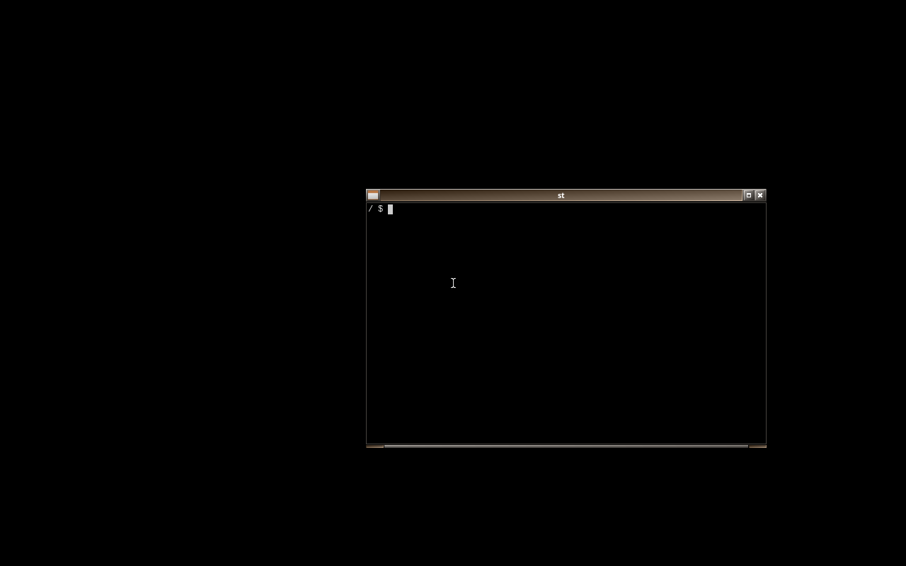
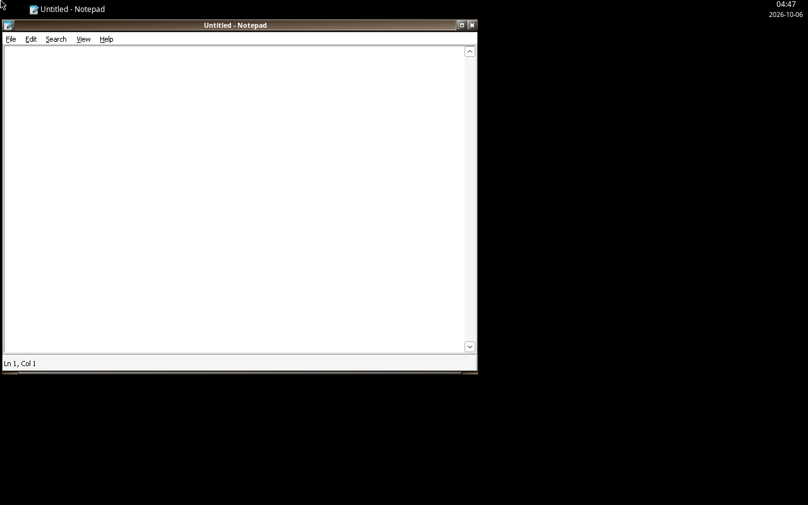
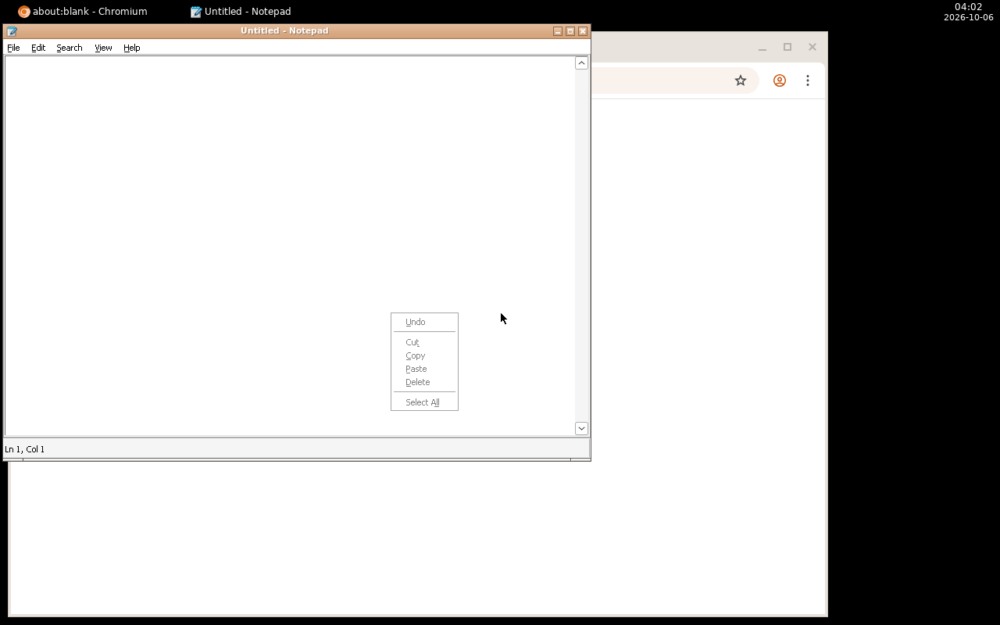
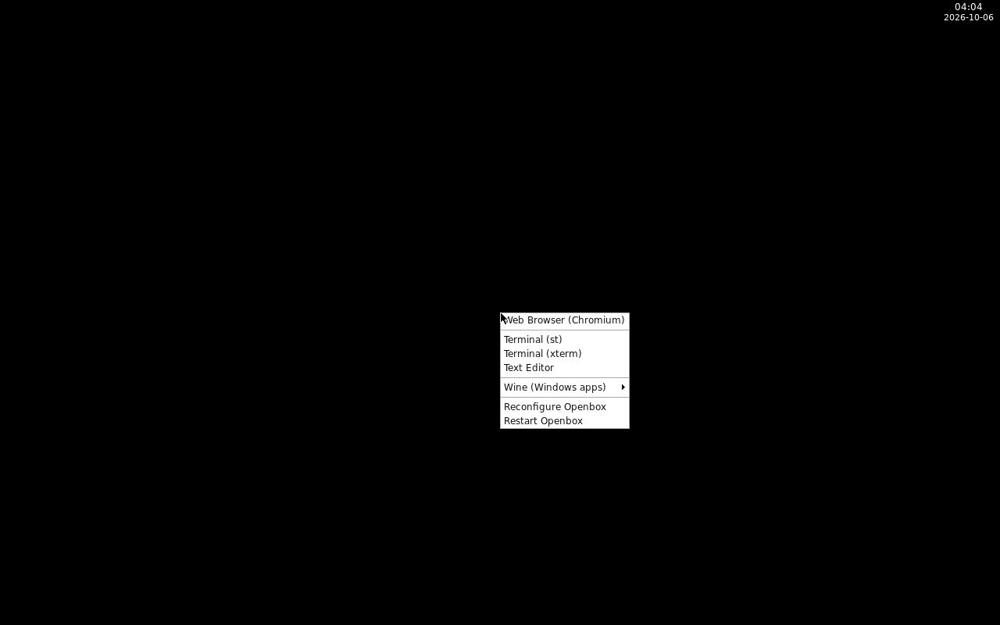

# alpine:openbox-novnc

一个从头构建的 Alpine + Openbox 桌面镜像，通过 **VNC / noVNC** 在浏览器中访问。
基础镜像就是官方 **`alpine:latest`**，所有组件都来自 Alpine 官方仓库——
没有第三方基础镜像，重建时只需跟随 Alpine 本身。

镜像刻意保持最小：**chromium + openbox + Xvnc**，加上会话运行必需的组件。
想再装别的软件（wine、文件管理器、播放器……）用构建参数 **`BUILD_PACKAGES`**。
**不带 docker cli**（v2 起移除），**不带状态栏面板**（v3 起移除），
桌面分辨率**跟着浏览器窗口自适应**（v3 起）。

> **本次变更**
> 1. **软件包改成构建参数 `BUILD_PACKAGES`**（可追加任意 Alpine 包）。**标准构建就是
>    wine 版**：`wine` + `xdotool` + `xwininfo`，写在 `docker-compose.yml` 里；
>    精简版（只有 chromium + openbox + Xvnc）是额外选项，不参与默认构建。
>    原先那些 wine 专有集成——助手脚本 `wine-webtop`/`wine-prefix-init`、Wine 右键
>    菜单、`.exe` MIME 关联——**全部删除**，终端里直接用 `wine`。
> 4. **数据目录改到 `/home/abc`**（原先 `/abc`），与容器用户 `abc` 的家目录一致。
> 2. **镜像改名**：`webtop:alpine-openbox-novnc` → **`alpine:openbox-novnc`**。
> 3. **其他版本资源删除**：`legacy/`（v1 与两个早期变体）以及
>    `scripts/fetch-baseimage.sh` 一并删掉，仓库只剩这一条线；旧版本只能从
>    git 历史里找。
>
> 更早：v3 去掉顶部面板、`Xvfb + x11vnc` 换成 Xvnc（分辨率自适应）；
> v2 去掉 `docker-cli` 并加入 Wine。

## 架构

```
Xvnc (:1, 初始 1280x800，之后随浏览器自适应)   ← X 服务器 + VNC 服务端，一个进程
  ├── openbox            ← 窗口管理器（无面板）
  ├── wine               ← 可选：只有 BUILD_PACKAGES 里要了才会装上
  └── websockify + noVNC (3000)  ← 浏览器访问（RFB 走 127.0.0.1:5901）
```

全部组件由 **supervisor** 托管，任一进程崩溃会自动重启。
所有软件包来自 Alpine 官方仓库，重建时只需跟随 Alpine 本身。

| 项目 | 本镜像 |
|---|---|
| 基础镜像 | **`alpine:latest` 官方（当前 3.24.2）** |
| Chromium | 跟随 Alpine 仓库（当前 152.x） |
| 串流层 | **Xvnc (TigerVNC 1.16.2) + noVNC 1.6.0** |
| 分辨率 | **自适应**（Xvnc 的 SetDesktopSize，浏览器窗口多大桌面就多大） |
| Windows 程序 | **内置** wine 11.x（含 32 位 WoW64）+ `xdotool` + `xwininfo` |
| 状态栏面板 | **无**（v3 移除 tint2） |
| docker cli | **无**（v2 移除） |
| 镜像体积 | **2.07 GB**（标准版）；精简版 `BUILD_PACKAGES=""` 为 1.47 GB |
| Web 端口 | **3000** |

## 目录结构

```
.
├── Dockerfile                   # 镜像定义（FROM alpine:latest + 裁剪/补丁/可选包）
├── root/                        # 镜像内文件系统覆盖层（COPY root /）
│   ├── etc/supervisor.d/        #   xvnc / openbox / novnc
│   ├── etc/cont-init.d/10-setup #   首次运行初始化（含默认文件升级）
│   ├── defaults/                #   menu.xml / rc.xml / autostart（*.v1 用于安全升级比对）
│   ├── usr/bin/                 #   start-desktop / chromium-webtop
│   ├── usr/local/bin/           #   openbox-style（外观）/ wine-fix-shell-folders（老卷自愈）
│   └── usr/share/novnc/app/     #   webtop-adaptive.js（强制自适应分辨率）
├── docker-compose.yml           # 构建 + 运行（默认 3000，可用 .env 覆盖；BUILD_PACKAGES 追加软件）
├── .env.example                 # WEB_PORT / CONFIG_DIR 等可调项模板
├── scripts/
│   ├── build.sh                 # 可选构建入口（传 BUILD_DATE + 别名标签）
│   ├── verify.sh                # 一键验证（标准镜像 42 项；精简版自动跳过 wine 等）
│   ├── chromium-regression.sh   # Chromium 菜单启动回归
│   ├── wine-regression.sh       # Wine 回归（仅当镜像里有 wine 时才会被 verify 调用）
│   ├── vncprobe.py              # VNC 像素探测（数颜色）
│   ├── vncresize.py             # 请求服务器改分辨率（验证自适应）
│   └── vncshot.py               # VNC 截图（存 PNG）
├── docs/
│   └── screenshots/             # README 引用的实拍截图
├── logs/                        # 验证日志 + 排查记录与脚手架
└── (无 legacy/)                 # 早期版本已删除，需要时从 git 历史取
```

> 构建上下文是**仓库根**：`.dockerignore` 只放行 `Dockerfile` 与 `root/`，
> 所以 `config/`（Chromium profile、Wine 留下的东西）、`logs/` 都不会被送进 daemon。

## 构建与运行

### 用 compose（推荐：构建 + 启动一条命令）

```bash
docker compose up -d --build     # 构建镜像并启动，UI 在 http://<主机IP>:3000
docker compose logs -f           # 入口横幅 + supervisor 日志
docker compose down              # 停掉（./abc 里的状态都保留）
```

compose 文件里带 `build:` 段（context = 仓库根，靠 `.dockerignore` 只送
`Dockerfile` 与 `root/`），
所以**不必先跑 `scripts/build.sh`**——那条路只是额外传一个真实的
`BUILD_DATE` 并多打一个 `webtop:alpine-openbox-<TAG>` 别名。
`docker compose ps` 会显示 `(healthy)`：镜像里用 busybox `wget` 探 3000 端口。

可调项都能用环境变量或 `.env` 覆盖（模板见 `.env.example`）：

| 变量 | 默认 | 说明 |
|---|---|---|
| `WEB_PORT` | `3000` | 发布到宿主机的端口（容器内固定 3000） |
| `CONFIG_DIR` | `./abc` | `/home/abc` 的位置：Wine 前缀、Chromium profile、桌面配置 |
| `APK_MIRROR` | `mirror.nju.edu.cn` | 构建时的 Alpine 镜像源 |
| `TAG` | `novnc` | 镜像别名标签（`webtop:alpine-openbox-<TAG>`） |

> 本机 3000 端口被常驻的 `webtop1` 占用，所以仓库**外**的本地 `.env` 里写了
> `WEB_PORT=3002`（`.env` 已被 gitignore）。删掉那一行或改成 `3000`
> 就是默认行为。

### 作为 Dockge / Portainer stack 部署

Dockge 这类工具是「一个目录一个 stack」：目录里放 `compose.yaml` 和它要挂的数据。
本项目的 stack 目录只需要两样东西——镜像仍然由源码那边构建：

```
/data/stacks/webtop3/
├── compose.yaml      # 服务定义，写 image: alpine:openbox-novnc
└── data/             # 挂到容器的 /home/abc：Wine 前缀、Chromium profile、桌面文件
```

`compose.yaml` 里**不需要** `build:`（这跟仓库里那份不同）：镜像由源码目录
`docker compose build` 产出，stack 只负责运行。加个 `x-dockge.urls`
Dockge 就能直接点开访问地址；`shm_size: 1gb`、`container_name`、
`deploy.resources.limits` 按需写。

### 不用 compose（等价写法）

```bash
./scripts/build.sh

docker run -d --name webtop \
  -p 3000:3000 \
  -e PUID=1000 -e PGID=1000 \
  -e TZ=Asia/Shanghai \
  -v "$PWD/home/abc:/home/abc" \
  --shm-size=512m \
  alpine:openbox-novnc
```

- `-p 3000:3000` 换成宿主上没被占用的端口即可（例如 `3002:3000`）。
- 建议 `--shm-size=512m` 或更大：Chromium 在默认 64 MB `/dev/shm` 下更容易卡。
- `/home/abc` 里存 Wine 前缀与 Chromium profile；把 `.exe` 丢进
  `config/Desktop` 就能在桌面里双击安装/运行。

浏览器打开 `http://<主机IP>:3000` → 直接进入 noVNC 桌面。

### 环境变量

| 变量 | 默认值 | 说明 |
|---|---|---|
| `PUID` / `PGID` | 1000 | 容器内 `abc` 用户 uid/gid |
| `TZ` | - | 时区，如 `Asia/Shanghai` |
| `VNC_RESOLUTION` | `1280x800` | **初始/最小**分辨率；浏览器连上后会按其窗口自适应调整（见下） |
| `VNC_DEPTH` | `24` | 色深 |
| `VNC_PORT` | `5901` | 内部 VNC 端口（**不对外暴露**） |
| `NOVNC_PORT` | `3000` | Web 端口 |
| `WINEPREFIX` | `/home/abc/.wine` | Wine 前缀目录（在 /home/abc 卷里，可持久化） |
| `WINEDEBUG` | `-all` | Wine 日志级别；排查问题时设成空值可看全部日志 |
| `WINEDLLOVERRIDES` | `mscoree,mshtml=` | 禁用 .NET/IE 组件：Alpine 没有 wine-mono/wine-gecko，禁用后程序快速报错而不是弹一个永远下载不完的对话框 |

改初始分辨率示例：`-e VNC_RESOLUTION=1920x1080`

### 分辨率自适应

浏览器打开后，noVNC 会把**浏览器可视区尺寸**通过 RFB `SetDesktopSize`
发给服务器，桌面（含已开窗口）随之重排；拖动/缩放浏览器窗口会再次触发。
所以 `VNC_RESOLUTION` 只是**起始尺寸**，既不是下限也不是上限：连接后浏览器
可以把它调大也能调小（实测 800×600 ~ 1920×1080 都照做）。

### 让"自动"真的自动（v3.1）

noVNC 解析设置值的顺序是（`app/ui.js` 的 `initSetting`）：

```
val = WebUtil.getConfigVar('resize');        // 1. URL 参数 ?resize=... / #resize=...
if (val === null) val = WebUtil.readSetting('resize', defVal);
                                         // 2. 先 localStorage，再默认值
```

也就是说：**浏览器里存过的值会盖掉镜像里的默认值**。旧版页面（默认还是
`resize=off`）在某个浏览器里存过 `off`/`scale`，那个浏览器就再也不会自动适配
了——改镜像默认值救不了它。

所以镜像里加了 `app/webtop-adaptive.js`，它被放在 **noVNC 初始化之前**加载
（`vnc.html` 里紧跟 `error-handler.js`），于是可以抢在解析之前把
`resize=remote` 写进存储：

- 浏览器里存着 `off`/`scale` → 被改写成 `remote`，自动适配恢复；
- URL 上显式写了 `?resize=off`（或 `scale`）→ **仍然优先**，脚本不干预；
- 存储不可用（隐私模式）→ 退回镜像默认值 `remote`，依然自适应。

没有用 noVNC 的 `mandatory.json`：那个会把设置项**锁死并置灰**，等于把选择权
彻底拿走；现在 URL 参数仍然是逃生口。

```
?resize=remote   默认，且会被这个脚本固化（推荐）
?resize=scale    只在浏览器端缩放，不动服务器
?resize=off      完全固定，不缩放也不改尺寸（截图/自动化用）
```

脚本会把结果写在 `<html data-webtop-resize="...">` 上，`verify.sh` 用无头
Chromium 打开真实页面读这个属性，确认覆盖真的生效（并且 `?resize=off` 仍然
被尊重）。

行为验证（在浏览器 profile 里真的种一个 `resize=scale`，再用它打开页面）：

| 浏览器里存的 | URL | 桌面尺寸（起始 1280×800，窗口 1000×700） |
|---|---|---|
| `scale` | 无参数 | **→ 1000×561**：覆盖生效，自动适配 ✅ |
| `scale` | `?resize=scale` | 保持 1280×800：显式参数优先，不干预 ✅ |

实现关键：v2 用的 `x11vnc` **会丢弃这个请求**（实测 1280x800 请求 1600x900
仍是 1280x800），v3 换成 TigerVNC 的 **Xvnc** 才会照做（同一次实测变成
1600x900）。noVNC 端的默认值也从 `resize=off` 改成 `resize=remote`
（构建时打补丁并断言，补丁失效则构建失败）。

判定 Xvnc 可用之前，先用一次性容器把它和 chromium、跨用户 X 认证一起验证过，
脚本留在 [`logs/dbg-xvnc-test.sh`](logs/dbg-xvnc-test.sh)（方法记录，非镜像内容）。

想临时关掉自适应（例如固定 1280x800 便于截图/自动化），访问时加参数即可：

```
http://<主机IP>:3000/vnc.html?resize=off
```

可选项：`off`（不缩放也不改服务器）、`scale`（浏览器端缩放显示，不改服务器）、
`remote`（默认，改服务器分辨率）。

实测（部署实例、桌面上开着一个 st 终端）：

| 1280×800（初始值） | 请求 1600×900 之后 |
|---|---|
|  |  |

注意：改的是**桌面尺寸**，已有窗口不会被拉伸（openbox 的常规行为）——
最大化后就会铺满新尺寸。

### 软件包：BUILD_PACKAGES（标准构建 = wine 版）

镜像的基础包只包含会话必需的东西，其余通过**构建参数 `BUILD_PACKAGES`** 追加
（Alpine 官方仓库里的包，空格分隔）。**默认值就是标准版要的那三个**，写在
`docker-compose.yml` 以及 stack 的 `compose.yaml` 里：

| 包 | 作用 |
|---|---|
| `wine` | 跑 Windows 程序（Alpine 11.x，含 32 位 WoW64） |
| `xdotool` | 在桌面里模拟按键/鼠标、取指针与窗口几何（脚本、自动化用） |
| `xwininfo` | 查看 X 窗口树/属性（窗口出问题时排查用） |

所以**什么都不用记**：

```bash
docker compose build            # 就是标准（wine）版：alpine:openbox-novnc
docker compose up -d --build

# 想再加软件（空格分隔，会与上面三个合并）
BUILD_PACKAGES="wine xdotool xwininfo pcmanfm gimp" docker compose build

# 精简版（chromium + openbox + Xvnc，1.47 GB）是额外选项，单独打标签、不默认构建
BUILD_PACKAGES="" IMAGE=alpine:openbox-novnc-lean docker compose build
```

它们与基础包**在同一次 apk 事务里安装**，所以重复依赖不会多占空间，
下面的裁剪步骤同样生效。

**Wine 怎么用**（如果构建时加了它）：镜像里**没有**任何 wine 专用的东西
（没有助手脚本、右键菜单里没有 Wine 子菜单、`.exe` 也没有 MIME 关联），
就是标准的 `wine`：

```bash
wine notepad                     # 自带程序
wine ~/Desktop/setup.exe         # 安装包 / 程序
wine winecfg                     # 配置（版本、盘符、音频…）
```

- `WINEPREFIX` 默认落在 `~/.wine`，也就是 **`/home/abc/.wine`**（在持久卷里，
  容器重建不丢）；第一次跑 wine 会自动建前缀（约十几秒）。
- **支持 32 位 Windows 程序**：Alpine 的 wine 用新版 WoW64 布局
  （`/usr/lib/wine/i386-windows`），不需要 multilib。
- **中文正常**：wine 通过 fontconfig 枚举系统字体，镜像里的 `font-noto-cjk`
  会被注册进前缀（`wine reg query "HKLM\Software\Microsoft\Windows NT\CurrentVersion\Fonts"` 能看到）。
- **没有 wine-mono / wine-gecko**：Alpine 仓库不提供。需要 .NET 的程序会直接失败；
  可从 `https://dl.winehq.org/wine/wine-mono/` 下载 `.msi` 后
  `wine msiexec /i mono.msi` 装上。
- **没有 winetricks**：Alpine 仓库不提供，需要就自己从上游拉。
- **音频**：容器里没有 PulseAudio 服务端，wine 不出声。

> 想让 wine 在桌面右键菜单里出现、或让 `.exe` 双击就打开，可以自行往
> `/defaults/menu.xml` 与 `/etc/xdg/mimeapps.list` 里加（旧版本就是这么做的，
> 可从 git 历史里参考）。

### 不再内置 docker cli（v2 起）

v1 镜像里带 `docker-cli`，可以把宿主机的 `/var/run/docker.sock` 挂进容器，
在桌面终端里操作 Docker。这个能力已在 v2 **移除**：

- 镜像里没有 `docker` 命令，挂 socket 也没用；
- `abc` 用户不再加入 `docker` 组；
- 相应地少了一份「容器内进程等同宿主机 root」的风险面。

需要这个能力时用 `BUILD_PACKAGES="docker-cli"` 重新构建（并自行挂 socket，风险自负）。
宿主机上的操作请直接在宿主机终端执行。

## Openbox 样式

Alpine 自带的 openbox 外观比较素，本镜像只改三处（都在
`root/usr/local/bin/openbox-style` 里，构建时施加并逐项断言）：

| 项目 | Alpine 默认 | 本镜像 |
|---|---|---|
| 窗口/菜单主题 | `Clearlooks` | **`Artwiz-boxed`** |
| 标题栏按钮布局 | `NLIMC`（带最小化） | **`NLMC`**（图标、标题、最大化、关闭） |
| 快捷键 | — | 多一个 `C-S-d` → 切换窗口装饰 |

主题文件不用另外装：`Artwiz-boxed` 就是 Alpine 官方 `openbox` 包自带的
`themerc`（`/usr/share/themes/Artwiz-boxed/openbox-3/themerc`，3.7 kB 纯文本，
没有位图）。

**其余一概保持 Alpine 原样**——菜单延迟、`showIcons`、鼠标绑定（包括桌面右键
弹根菜单）、focus/placement、`dragThreshold` 以及主题里的 6 处字体
（标题 `sans 8 bold`、菜单 `sans 9 normal`）。这些正是"右键菜单能用"这个修复
依赖的地方，刻意不动。

字体：镜像里装了 `font-noto`。因为 rc.xml 要的是 `sans`，只装 `font-dejavu`
的话会解析到 DejaVu，标题栏就不是截图里的样子了。

脚本是幂等的，并且对每个要改的值都有断言——将来 Alpine 改了默认主题名，
构建会**直接失败**，而不是悄悄产出一个半样式镜像。

```bash
# 构建日志里会打印结果
theme: Clearlooks -> Artwiz-boxed
titleLayout: NLIMC -> NLMC
keybind: added C-S-d -> ToggleDecorations
```

### 菜单图标

菜单条目都带 48×48 图标（路径都验证过存在于镜像内）：

| 条目 | 图标 |
|---|---|
| Web Browser (Chromium) | `/usr/share/icons/hicolor/48x48/apps/chromium.png` |
| Terminal (st) / (xterm) | `/usr/share/pixmaps/xterm-color_48x48.xpm` |
| Text Editor | `/usr/share/icons/hicolor/48x48/apps/org.xfce.mousepad.png` |

### 效果对照

| 改之前（Clearlooks，NLIMC） | 改之后（Artwiz-boxed，NLMC） |
|---|---|
|  |  |

标题栏从米黄 Clearlooks 变成 Artwiz-boxed 的深灰渐变、标题居中，按钮少了最小化。

## Bug 修复：老卷里悬空的 Wine shell 文件夹软链（应用闪退）

**症状**：Wine 应用点开**现代**文件对话框时整个进程瞬间消失（MT5 的表现是图表右键
→ 模板 → 加载模板，终端直接退出后自重启）。只走老式 `GetOpenFileName` 的入口
（notepad 的打开）却正常，所以很容易误判成应用自身的问题。

**根因**：Wine 建 prefix 时会把 Windows 的 shell 文件夹做成指向 `$HOME` 的软链：

```
.wine/drive_c/users/abc/Desktop -> $HOME/Desktop
```

镜像的默认家目录改过两次（`/config` → `/abc` → `/home/abc`），而 prefix 在挂载卷里
跨过了这些改动，软链于是指向不存在的目录。Wine 的 shell 命名空间**以桌面为根**，
解析失败后 `comdlg32` 的 `IFileDialog` 构造路径解引用了空接口指针：

```
commdlg:DllGetClassObject {DC1C5A9C-...}       CLSID_FileOpenDialog
→ Exception C0000005 at comdlg32.dll+0x10897 (read to 0x0)
```

诊断信号（`WINEDEBUG=+shell`）：

```
SHGetFolderPathAndSubDirW returning 0x80070003 (final path is L"C:\users\abc\Desktop")
                                       ^^^^^^^^ ERROR_PATH_NOT_FOUND
```

**修复**：镜像启动时自愈，`root/usr/local/bin/wine-fix-shell-folders` 由
`10-setup` 在桌面起来之前调用——发现悬空链就重指到当前 `$HOME/<名字>` 并补建目录：

```
[dangling] /home/abc/.wine/drive_c/users/abc/Desktop
           points at : /config/Desktop   (does not exist)
           should be : /home/abc/Desktop
           fixed     : ... -> /home/abc/Desktop
```

也可以手动用：

```sh
wine-fix-shell-folders --check            # 只检查（有问题退出码 1）
wine-fix-shell-folders                    # 修复 $WINEPREFIX 或 ~/.wine
```

`verify.sh` 用**反例**守住它：造一个带 `/config/Desktop` 悬空链的卷，启动镜像后必须
被改成 `/home/abc/Desktop` 且可解析；另外 `/home/abc/.wine` 里若还有任何悬空链，
wine 段的 `--check` 会报错。

## Bug 修复：openbox 右键菜单 webbrowser 打不开 chromium

### 现象

右键菜单点 "Web Browser"，`pgrep chromium` 能看到进程，但**窗口永远不出现**。
实际抓到的是一个 **10x10、`IsUnMapped`** 的窗口桩。

### 三个根因（全部已修复）

**1. Chromium 去探测 Wayland，导致窗口无法映射**

Alpine 在 `/etc/chromium/chromium.conf` 里预置了：

```
CHROMIUM_FLAGS="--ozone-platform-hint=auto"
```

本镜像没有 Wayland 合成器（渲染到 Xvnc），这个探测让 Chromium 拿到一个
无法映射的 10x10 桩窗口 —— 进程活着，但什么都没画出来。

→ 包装脚本强制 `--ozone-platform=x11`。

**2. 首次运行的「Additional Terms of Service」对话框**

全新 profile 启动时 Chromium 会卡在首次运行的服务条款对话框上。
在浏览器串流的场景下，这看起来就是"浏览器没打开"。

→ 加 `--no-first-run --no-default-browser-check`。

**3. GPU / Vulkan 初始化失败**

Chromium 自带 `libvulkan.so.1`，但容器里没有 Vulkan ICD 也没有 GPU：

```
eglInitialize SwANGLE failed with error EGL_NOT_INITIALIZED
Initialization of all EGL display types failed
Exiting GPU process due to errors during initialization
```

Chromium 通常会回退到软件渲染，但反复的 GPU 进程崩溃让启动变得不稳定、
日志被刷屏。

→ 显式禁用 GPU / Vulkan / SkiaRenderer，直接走软件渲染。

修复集中在 **`root/usr/bin/chromium-webtop`**，
菜单项调用的是这个包装脚本而不是裸 `chromium`。

### 排查过程中的一个坑（记录备查）

用 `docker exec` 后台启动 Chromium 做测试时，**exec 会话结束时会把进程组一起杀掉**，
Chromium 来不及映射窗口就死了 —— 表现和原始 bug 一模一样，极易误判。
测试脚本因此必须用 `setsid`（见 `scripts/chromium-regression.sh`）。

## Bug 修复（v2 发现）：右键菜单整个是空的（XML 注释里的双减号）

### 现象

v1 的 `menu.xml` 注释里原样写了 Chromium 的启动参数：

```xml
<!-- Raw `chromium` inherits Alpine's CHROMIUM_FLAGS="--ozone-platform-hint=auto" ... -->
```

XML 规范**不允许注释里出现 `--`**，libxml2 因此判定整个文件非法，
Openbox 解析失败后回落到"空菜单"—— 右键点桌面什么都弹不出来，
`~/.config/openbox/menu.xml` 写得再全也没用。

实测（alpine + openbox，`xmllint` 与 openbox 本身都报错）：

```
menu.xml:6: parser error : Double hyphen within comment: <!--
  Raw `chromium` inherits Alpine's CHROMIUM_FLAGS="--ozone-platform-hint=auto",
                                                   ^
```

也就是说，之前"菜单里点 Web Browser 打不开 Chromium"的前提其实不成立：
菜单根本没加载。Chromium 包装脚本本身的问题（见上一节）是真的，
但只有把 `menu.xml` 修好、菜单能加载，那些修复才点得到。

### 修复

- 注释里不再出现 `--`（参数写成 `ozone-platform-hint=auto`，并加了大写警示
  注释，防止后人"好心"加回去）；
- 新增回归检查：`scripts/verify.sh` 会扫 `openbox.log` 里的
  `parser error`，一旦重现就报错。

### 附带修好的：老卷升级不会丢新菜单

`/home/abc` 是持久卷，v1 用过的卷里存着老版 `menu.xml`/`autostart`。
`10-setup` 原本"文件存在就不覆盖"，会让新加的 Wine 菜单永远不出现。
现在改成：

- 文件不存在 → 装默认值；
- 文件与**我们发过的旧默认值**（`/defaults/*.v1`）逐字节相同 → 判定为未被
  用户改过，升级为新默认值；
- 其他情况 → 保留用户文件，并打日志说明。

## 历史记录：tint2 面板（v3 已移除）

v2 时镜像里有个 tint2 顶部面板（时钟 + 窗口按钮），当时踩过一个坑，
v3 按需求把面板整个删掉后问题不复存在，但结论值得留着。

### 现象

新卷首次启动，面板几秒后消失、整屏变黑（只剩光标）。supervisor 的原始记录
才是真相（`pgrep` 之类都会误导）：

```
WARN exited: tint2 (terminated by SIGSEGV (core dumped); not expected)
```

**是段错误，不是"退出"**；面板当时由 openbox autostart 拉起，死了没人管。

### 根因（gdb 回溯）

```
#0 gradient_point_area_dependent     <- 崩在这里
#1 gradient_init
#2 area_gradients_create
#3 set_task_state
#5 taskbar_refresh_tasklist
#6 handle_event_property_notify      <- 一次 X PropertyNotify 触发
```

即 tint2 自身 bug：刷新任务栏时在渐变代码里段错误。
触发器是 Wine 的窗口 churn —— Wine 建前缀/起程序会拉起
`services.exe`、`winedevice.exe`、`explorer.exe /desktop` 等一族进程，
每个都带来窗口和任务栏项的上下线。

当时的处置（v3 删掉面板后都不再需要，仅作记录）：

1. **Wine 前缀改为无 X 构建**（当时那个 `wine-prefix-init --headless` 助手；
   现在 wine 是可选的额外包，助手脚本已随集成一起删除）：
   同一场景崩溃次数 14 → 0。这个改动**仍然保留**（少一族 X 客户端，
   启动更干净），只是理由从"别打死面板"变成"别在开机时惊动 Wine"。
2. **tint2 交 supervisor 托管**：启动 Windows 程序仍会崩一次，1 秒内自动拉回。

### 踩坑记录（两个，都还有普遍意义）

- **`unset DISPLAY` 的假无头**：第一版 `--headless` 写 `unset DISPLAY`，
  而脚本后面有 `export DISPLAY="${DISPLAY-:1}"`，该默认值只在 DISPLAY
  **未设置**时生效 —— 一 unset 就被填回 `:1`，"无头"其实没生效。
  正确做法是显式赋空值。现在初始化日志会打印
  `creating prefix /home/abc/.wine (headless=yes DISPLAY='')`，一眼可验。
- **"服务是 RUNNING"证明不了健康**：崩溃循环里约一半时间也能采样到 RUNNING。
  现在 `verify.sh` 会比对 12 秒前后 pid 是否一致，并检查启动阶段
  `grep -c "tint2.*SIGSEGV"` 为 0（v3 已随面板移除）。
- 另一个纯排查陷阱：本镜像里 busybox 的 `pgrep -x tint2` 匹配不到任何东西，
  用它判断进程死活会把结论完全带偏，改用 `pgrep tint2` 或
  `ps -eo pid,args | grep`。

完整排查记录见 [`logs/tint2-wineboot-timeline.log`](logs/tint2-wineboot-timeline.log)。

## 验证

```bash
PROBE_HOST=<主机IP> ./scripts/verify.sh
```

实测结果（全新 volume，标准镜像）：

**`alpine:openbox-novnc`**（2.07 GB = wine + xdotool + xwininfo）——**42/42 通过**（完整日志 `logs/verify-standard.log`）：

```
   [ OK ] container is running
   [ OK ] service 'xvnc' is RUNNING
   [ OK ] service 'openbox' is RUNNING
   [ OK ] service 'novnc' is RUNNING
   [ OK ] core tool 'chromium' is present
   [ OK ] core tool 'openbox' is present
   [ OK ] wine is installed (BUILD_PACKAGES asked for it)
   [ OK ] xdotool works (reads the pointer position from :1)
   [ OK ] xwininfo works (lists the root window's children)
   [ OK ] docker cli is absent (removed in v2)
   [ OK ] no wine-specific integration in the image
   [ OK ] the seeded desktop menu has no Wine entries
   [ OK ] the wine-era menu is shipped as an upgrade target (menu.xml.v2)
   [ OK ] Openbox menu.xml parses (no libxml2 parser errors)
   [ OK ] openbox theme is Artwiz-boxed
   [ OK ] openbox titleLayout is NLMC (no minimise button)
   [ OK ] Artwiz-boxed themerc is installed
   [ OK ] 'sans' resolves to Noto Sans (NotoSans-Regular.ttf)
   [ OK ] C-S-d keybind present (toggles window decorations)
   [ OK ] no panel: tint2 is not installed
   [ OK ] no tint2 supervisor entry
   [ OK ] a stale Wine shell link (/config/Desktop) is repaired at boot
   [ OK ] VNC server completed an RFB handshake
   [ OK ] framebuffer reports 1280x800
   [info] idle desktop framebuffer has 2 unique colours (panel-less: expect ~2)
   [ OK ] noVNC responds HTTP 200
   [ OK ] served page is the noVNC UI
   [ OK ] the adaptive-resize script is served by noVNC
   [ OK ] vnc.html loads the adaptive-resize script
   [ OK ] a real browser applied the override (data-webtop-resize=remote)
   [ OK ] ?resize=off still overrides the default (escape hatch works)
   [ OK ] Chromium opens a real window via the menu launcher
          _NET_WM_NAME(UTF8_STRING) = "about:blank - Chromium"
   [ OK ] desktop resizes on request (SetDesktopSize honoured, after=(1500, 850))
   [ OK ] framebuffer reports the requested size after the resize
   [ OK ] the open window repaints at the new size (623 unique colours)
          wine_version=wine-11.0
          cmd64=Microsoft Windows 10.0.19045
          cmd32=Microsoft Windows 10.0.19045
          cjk_fonts=65
          wine_prefix=ready
          notepad_procs=1
          window=_NET_WM_NAME(UTF8_STRING) = "about:blank - Chromium" WM_CLASS(STRING) = "chromium-browser", "Chromium-browser"
          window=_NET_WM_NAME(UTF8_STRING) = "Untitled - Notepad" WM_CLASS(STRING) = "notepad.exe", "notepad.exe"
   [ OK ] wine runs (wine-11.0)
   [ OK ] wine built its prefix on demand under /home/abc
   [ OK ] 64-bit loader runs a Windows program (wine cmd /c ver)
   [ OK ] 32-bit WoW64 runs an i386 PE (syswow64\cmd.exe)
   [ OK ] Wine sees the image's Noto fonts (65 entries via fontconfig)
   [ OK ] wine notepad maps a real window
          window=_NET_WM_NAME(UTF8_STRING) = "Untitled - Notepad" WM_CLASS(STRING) = "notepad.exe", "notepad.exe"
   [ OK ] the Wine prefix has no dangling shell-folder links
   [ OK ] desktop still paints after the Chromium and Wine tests (1004 unique colours)

 passed: 42   failed: 0
```

精简构建（`BUILD_PACKAGES=""`，1.47 GB，只有 chromium + openbox + Xvnc）会自动跳过
wine / xdotool / xwininfo 相关检查，其余同样全绿。

> 这些数字要在**串行**下测得：并行跑两份验证（或在 stack 重建的同时跑）会让首启
> Chromium 超过等待时间而误报。`verify.sh` 现在轮询最多 120 秒再判定失败。


精简构建（`BUILD_PACKAGES=""`，1.47 GB，只有 chromium + openbox + Xvnc）会自动跳过
wine / xdotool / xwininfo 相关检查，其余同样全绿。

> 这些数字要在**串行**下测得：并行跑两份验证（或在 stack 重建的同时跑）会让首启
> Chromium 超过等待时间而误报。`verify.sh` 现在轮询最多 120 秒再判定失败。

### 桌面实拍（本机跑的容器）

| 截图 | 内容 |
|---|---|
|  | **部署实例 `webtop3`（端口 3002）实拍**：Wine 的 Notepad 在跑，顶部 tint2 面板显示任务按钮与时钟 |
|  | 同一次验证里 Wine Notepad + Chromium 同时开着（面板任务栏两个按钮） |
|  | 桌面右键菜单，含 **Wine (Windows apps)** 子菜单入口 |
|  | Wine 子菜单展开：文件管理器 / Notepad / winecfg / regedit / 卸载 / 命令提示符 |

截图由 `scripts/vncshot.py` 抓取（纯标准库 RFB 客户端，直接存 PNG）。

## 体积

| 版本（同一台机实测） | Alpine | 镜像 |
|---|---|---|
| v1 基线，`legacy/Dockerfile.v1-dockercli` | 3.22 | 1.39 GB |
| v2：去 docker-cli、加 Wine + 自定义样式 | 3.22 | 1.92 GB |
| v3：去 tint2、Xvfb+x11vnc 换 Xvnc | 3.22 | 1.91 GB |
| **当前：`FROM alpine:latest`** | **3.24.2** | **2.07 GB** |

涨的 160 MB 全是上游包变大，不是裁剪失效（逐项对比 3.22 → 3.24）：

```
wine        372 MB -> 410 MB     chromium   263 MB -> 308 MB
libLLVM     170 MB -> 182 MB     libgallium  39 MB ->  42 MB
gallium-pipe 8.4 MB -> 已不存在（3.24 里 mesa 不再装那个目录）
```

当前镜像里仍然生效的裁剪：`numpy`/`openblas` 0 残留、`NotoSerifCJK` 0 残留、
`perl` 已删（`tigervnc` 的唯一理由）、`numpy` 的路径已改成
`/usr/lib/python3.*/site-packages/` 以适配 3.24 的 Python 3.14。

### 删掉了什么

| 内容 | 大小 | 原因 |
|---|---|---|
| `gallium-pipe` 里的显卡驱动 | ~90 MB | 每个 `.so` 对应一款 GPU（iris/crocus/radeonsi/nouveau/i915/r300/r600/vmwgfx）。容器里没有 GPU，只保留软件光栅化 `pipe_swrast.so` |
| `numpy` + `openblas` | ~73 MB | 只有 websockify 用到，而它是在 `try/except ImportError` 里导入的，缺了只是日志提示 "HyBi protocol will be slower" |
| `NotoSerifCJK` 衬线字体 | 51 MB | `NotoSansCJK` 已覆盖全部中文 UI/网页渲染；实测 `fc-match serif:lang=zh-cn` 也会回落到 Sans |
| `docker-cli`（v2 新增裁减） | ~31 MB | `/usr/bin/docker` 单个 Go 二进制，v1 里的 docker cli 全部内容；见上文「不再内置 docker cli」 |
| `apk` 缓存、doc、man | ~small | 运行期无用 |

### 必须保留的"伪垃圾"（重要）

`libLLVM.so.20`（170 MB）和 `libgallium`（40 MB）看起来像同类 GPU 冗余，
但**删不得**：

```
Xvfb → libGL.so.1 → libgallium → libLLVM.so.20
```

删掉后 Xvfb 直接起不来，整个桌面挂掉：

```
Error loading shared library libgallium-25.1.9.so: No such file or directory
        (needed by /usr/lib/libGL.so.1)
```

**踩坑记录**：我第一次在**运行中的容器**里把这两个文件挪走测试，Chromium 和
VNC 都还正常，于是误判可以删。实际上那只是因为 Xvfb **早就启动好了**，
依赖只在进程启动时加载 —— 换成新建容器就立刻崩。

> 教训：验证精简效果必须 **新建容器**，不能在运行中的容器里改文件后测。

### 为什么 prune 必须和 install 写在同一个 RUN

Docker 分层机制下，在**后续** RUN 里删文件**不会**让镜像变小 —— 数据仍留在
`apk add` 那一层，只是在上面记了个 whiteout。实测历史层大小：

```
1.2GB  RUN ... apk add ...
  0B   RUN ... rm -rf ...     ← 删除层是 0B，一点没省
```

把 prune 合并进 install 那个 RUN 之后，镜像才真正从 1.66 GB 降到 1.38 GB。

## 中国线路优化

### 1. Alpine apk 国内镜像

Dockerfile 在**任何安装动作之前**改写 `/etc/apk/repositories`。本网络实测：

| 镜像 | 结果 |
|---|---|
| **mirror.nju.edu.cn** | **200，约 1.5 MB/s ← 采用** |
| dl-cdn.alpinelinux.org | 200，约 0.8 MB/s |
| mirrors.ustc.edu.cn | 403 |
| mirrors.tuna.tsinghua.edu.cn | 403 |
| mirrors.aliyun.com | 200，约 0.16 MB/s |

```bash
APK_MIRROR=mirrors.aliyun.com ./scripts/build.sh
```

镜像源写进镜像内，容器运行期 `apk add` 同样走国内源。

### 2. Docker Hub 加速

本机 dockerd 已配置 `docker.1ms.run` / `hub1.kaijuu.studio`（未改动宿主机配置）。

## 已知的小瑕疵

- Chromium 在无 GPU 环境下会刷 `eglInitialize SwANGLE failed` /
  `Exiting GPU process` 之类的日志（Xvfb 和 Xvnc 下都有），是软件渲染的正常
  噪声，窗口照常映射（回归测试每次都验）。
- 极小的浏览器窗口（例如 < 400×300）会把桌面缩到那个尺寸，窗口可能挤在一起 ——
  这是"自适应"的必然结果；想要固定尺寸用 `?resize=off` 打开。
- 日志里的 `Unable to connect to the SYSTEM Bus` 是容器内没有 system dbus 所致，
  不影响功能。
- Wine 里没有声音（容器内没有 PulseAudio 服务端）、没有 wine-mono / wine-gecko
  （Alpine 仓库不提供）。

## 说明

- 本镜像是**独立重建**：基础镜像是官方 `alpine:latest`，不含任何第三方基础镜像，
  也不含历史版本（早期的 v1 与两个变体已删除，需要时从 git 历史取）。
- VNC 端口 `5901` **未对外发布**，而且 Xvnc 以 `-localhost` 起，只监听回环，
  只有容器内的 websockify 能连。如需用原生 VNC 客户端直连，要同时去掉
  `-localhost`（`etc/supervisor.d/xvnc.ini`）并 `-p 5901:5901`，
  且注意 `-SecurityTypes None` 表示**没有密码**。
- 镜像里**没有 docker cli**（v2 移除），桌面里不能操作宿主机 Docker；
  相关历史与恢复办法见上文「不再内置 docker cli」。

## 许可

本项目（Dockerfile、脚本、文档）以 **MIT** 发布，见 [LICENSE](LICENSE)。

镜像里安装的所有组件都来自 Alpine 官方仓库，各自遵循自己的许可
（Chromium/BSD、openbox/GPL-2.0、Xvnc/TigerVNC GPL-2.0、Wine LGPL-2.1、
websockify/noVNC、tint2 已移除……），使用与再分发时请一并遵守。
`openbox-style` 只是把 openbox 自带主题与三个配置项的取值改成我们想要的样子，
不含任何第三方代码。
